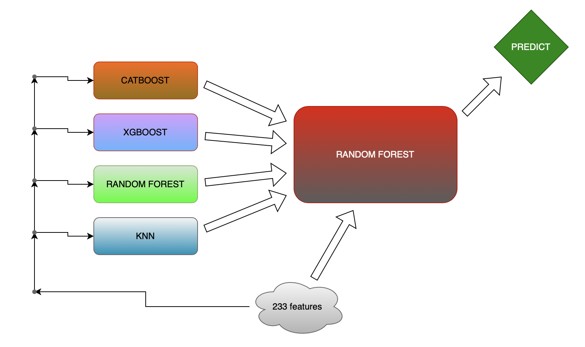

# Pump_It_Up
    
Данная работа основана на соревновании: **https://www.drivendata.org/competitions/7/pump-it-up-data-mining-the-water-table/**

Работа находится в файле *Water_Pumps_Tanzania.ipynb*

---
    
**Задача**: используя данные Таарифы и Министерства водного хозяйства Танзании, предсказать, какие **водяные насосы** **работают**, какие **требуют ремонта**, а какие вообще **не работают**?
    
---
    
**Акцент** в исследовании сделан на тюнинг моделей таких, как: `Catboost`, `Xgboost`, `RandomForest`, `KNN`; и их последующий `stacking`.  
    
---   

*Метрика качества*: ***Accuracy***

---

Папка `models` с обученными моделями находится по ссылке: https://drive.google.com/drive/folders/1BJjyH2QF2I5zjQpqtE3ofiP2VWs6Zw1D
    
---

Итоговый результат: качество прогнозирования по **`Accuracy = 0.8238`, занятое место = 802 (всего участников 17200**)

---

## Архитектура итоговой стекинг модели:

